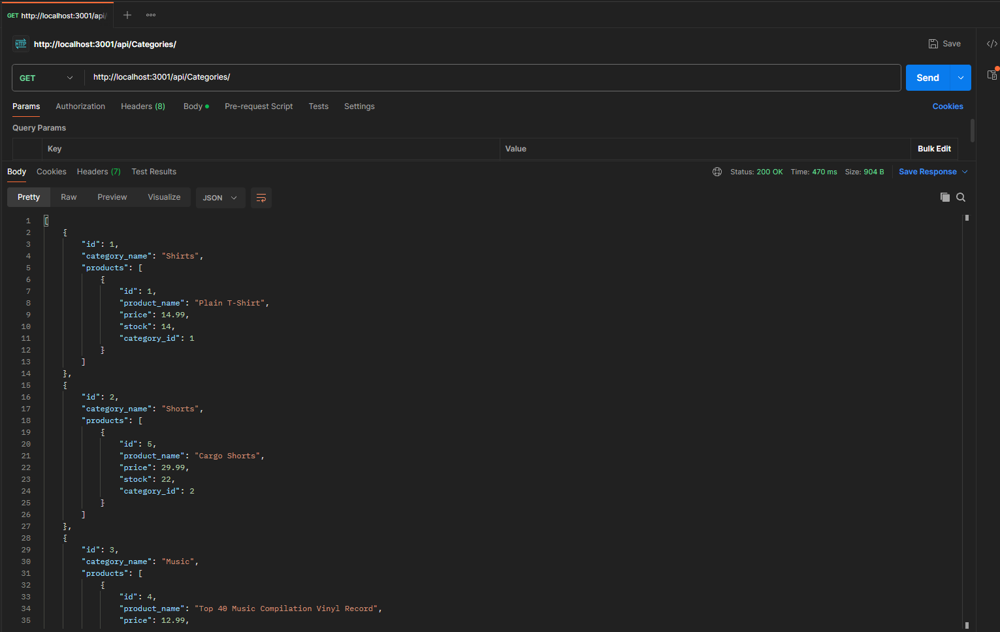

# E-Commerce Back End

## Description

The intention of this project was to practice, and improve my technical skill with using Express. I was provided initial code, and my goal was to setup the correct routes using mysql2, and sequelize, to ensure that the provided tag, product, and category routes all work correctly. This app can be tested by using a program such as Postman, or Insomnia to hit all of the back end routes. For each of the three routes, you are able to get all items, get one by id, post, put, and delete.

## Table of Contents

- [Installation](#installation)
- [Usage](#usage)
- [Credits](#credits)
- [License](#license)
- [Questions](#questions)

## Installation

Clone the repository. Run `npm install` within the console to install the dependencies required. Once that is done, you will need the database to be created and seeded. Assuming you have mysql, you are able to run mysql -u root -p, and then type your password to start mysql in the command line. You can then enter `SOURCE ./db/schema.sql` to initialize the database. Once you have completed this, go to your node console and run `npm run seed` to populate the database. Now that your database is created and seeded, you can run `node server.js` to start the server.

## Usage

For a walkthrough video on using the app, please visit this link! 

https://drive.google.com/file/d/1aTHS-_yEnpOYQVTMXBwm8gx3XB7JqpH0/view?usp=sharing

## Credits

Credit to the UofM Bootcamp for providing the initial starter code to the project

## License

This project is licensed under the MIT license. License link: https://opensource.org/license/mit/

## Questions

You can see below to reach me for any questions you have regarding the project.

https://github.com/rb2277

